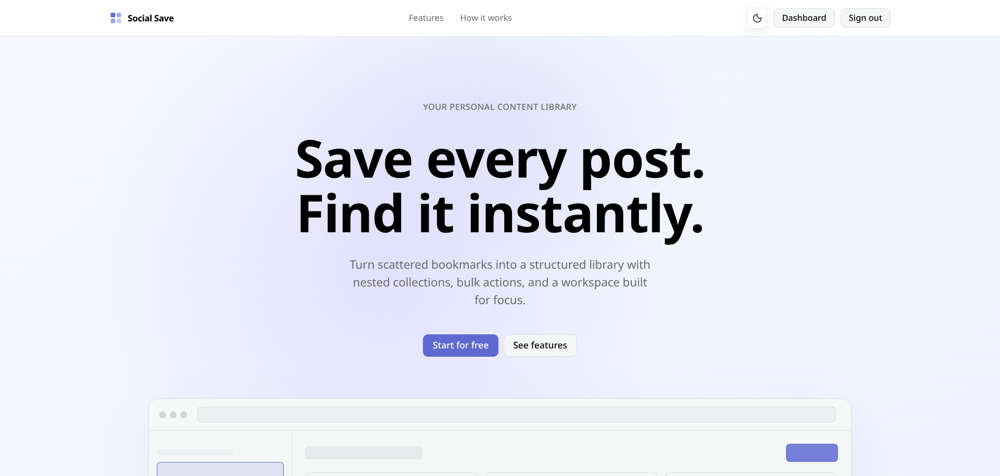
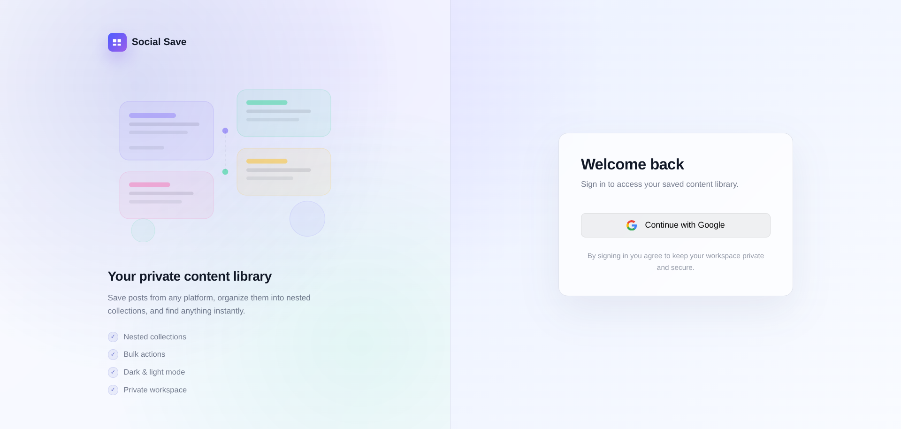
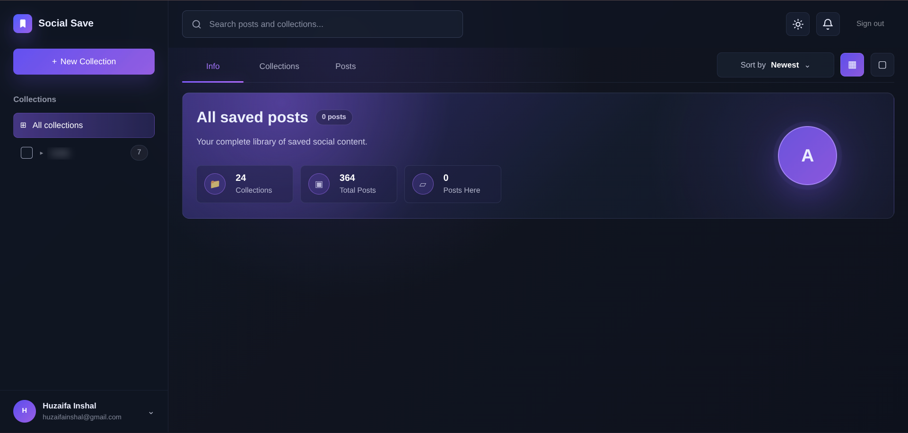
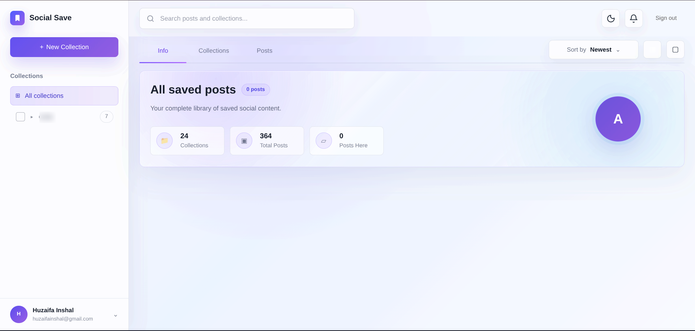

# Social Save - Web Application

A Next.js + TypeScript web application for organizing saved social posts into nested collections with Firebase Auth and Firestore.

## Features

- **Dynamic Embeds**: Custom player integrations for Instagram Reels, Facebook Videos, TikTok Videos, and YouTube.
- **Organization**: Recursive collections with smooth moves and drag-like selection.
- **Bulk Actions**: Bulk import, bulk move, and bulk delete.
- **User Authentication**: Google-only sign-in with Firebase Authentication.
- **Theme Support**: Fully responsive UI with sleek Light and Dark mode options.

## Gallery & Preview

### Landing Page


### User Authentication (Sign In)


### Dashboard - Dark Theme


### Dashboard - Light Theme


## Development Setup

1. Copy `.env.example` to `.env.local` and fill in your Firebase credentials.
2. Install dependencies:
   ```bash
   pnpm install
   ```
3. Run the development server:
   ```bash
   pnpm dev
   ```

## Firebase Configurations

- **Rules**: Deploy `firestore.rules` to secure user database reads/writes by `ownerId`.
- **Indexes**: Deploy `firestore.indexes.json` to enable composite index queries for sorting posts and collections.
